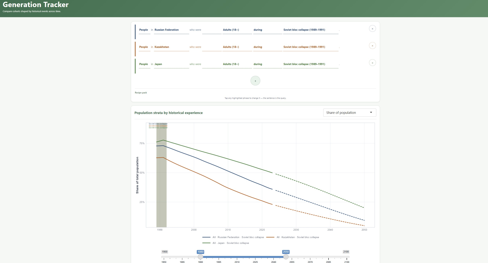

# Generation Tracker

**Sizing the generations shaped by major historical events — reproducibly, from raw demography to an interactive chart.**

**Generation Tracker** is an analytical prototype for exploring how major historical events shape the demographic weight of different generations. Many economic and cultural attitudes are partly formed by lived experience: people who were adults during a sovereign default, children during a war, or born after a political transformation carry very different reference points. This project turns that intuition into a reproducible demographic tool.



The app lets a user build sentence-like questions and get a sized time series in return:

-   People in Greece who were Adults (18+) during a sovereign default.
-   Men in Russia who were School age (6–17) at the beginning of the War in Afghanistan.
-   People in Russia who were not born yet at the end of the Soviet Union.
-   People in Montenegro who were Adults (18+) at the end of the breakup of Yugoslavia.

It combines demographic data, structured event histories, and transparent cohort logic. It does **not** claim to prove causal effects on behavior. Instead, it quantifies the demographic scale of plausible historical-experience hypotheses.

## Intellectual background

The premise — that formative macroeconomic and political experiences leave a lasting imprint on a generation's economic behavior — is well grounded in economics and sociology:

-   **Mannheim (1928), ["The Problem of Generations"](https://www.marxists.org/reference/subject/philosophy/works/ge/mannheim.htm)** — the classic sociological framing of generations as cohorts shaped by shared historical experience.
-   **Inglehart (1977), [*The Silent Revolution*](https://press.princeton.edu/books/paperback/9780691022963/the-silent-revolution)** — a foundational account of intergenerational value change in advanced industrial societies.
-   **Alesina & Fuchs-Schündeln (2007), ["Goodbye Lenin (or Not?)"](https://www.aeaweb.org/articles?id=10.1257/aer.97.4.1507)** *(American Economic Review)* — exposure to communism leaves lasting preferences for state intervention.
-   **Malmendier & Nagel (2011), ["Depression Babies: Do Macroeconomic Experiences Affect Risk Taking?"](https://doi.org/10.1093/qje/qjq004)** *(Quarterly Journal of Economics)* — people who lived through low returns or the Great Depression take less financial risk for decades.
-   **Giuliano & Spilimbergo (2014), ["Growing up in a Recession"](https://doi.org/10.1093/restud/rdt040)** *(Review of Economic Studies)* — experiencing a recession between ages 18–25 durably shifts beliefs about luck vs. effort and support for redistribution.
-   **Malmendier & Nagel (2016), ["Learning from Inflation Experiences"](https://doi.org/10.1093/qje/qjv037)** *(Quarterly Journal of Economics)* — lifetime inflation experience shapes individual inflation expectations.
-   **Malmendier (2021), ["Exposure, Experience, and Expertise"](https://www.nber.org/papers/w29336)** *(Journal of the European Economic Association)* — a broad synthesis of how personal histories matter in economic decision-making, including among experts.
-   **Georgarakos & Popov (2024), ["I (Don’t) Owe You: Sovereign Default and Borrowing Behavior"](https://papers.ssrn.com/sol3/papers.cfm?abstract_id=4708140)** *(ECB Working Paper 2024/2893)* — people exposed to sovereign default episodes are less likely to hold debt and borrow less when they do.

This literature *estimates* such effects. Generation Tracker complements it by *sizing* the exposed cohorts those studies reason about — turning a historical-experience hypothesis into a reproducible time series of how large a group is and how its weight changes over time.

## How it works

A user composes a query in plain language:

> Men in Russia who were School age (6–17) at the beginning of the War in Afghanistan.

Internally the app encodes it as a reproducible **recipe** — country, sex, age-status, complement flag, event, event-timing rule, and output metric — and returns a time series of the cohort's size or population share, with a documented set of assumptions and an exportable chart and dataset.

## Intended use

-   Economists and analysts testing historical-experience hypotheses.
-   Researchers preparing charts for reports or presentations.
-   Data storytellers who need a transparent way to compare generations.
-   Anyone interested in the demographic structure of collective memory.

## Technical design

-   **R + Shiny** with a modern tidyverse stack and a strictly layered architecture: data preparation, cohort/business logic, and presentation are kept separate.
-   Deterministic, testable functions; every query is captured as a reproducible recipe, so results can be shared and re-run exactly.
-   Heavy inputs (UN WPP population, economic indicators, curated event catalogues) are processed **offline**; the app loads prepared artifacts for a fast, reliable startup.
-   Full pipeline, environment variables, and validation rules: [`docs/dev_workflow.md`](docs/dev_workflow.md) · data updates and deployment: [`docs/data_maintenance.md`](docs/data_maintenance.md).

## Getting started

Place the source data in `data/`, build the prepared artifacts once, then run the app:

``` bash
Rscript scripts/build_prepared_population.R   # build data/population.rds from WPP Excel + 0_countries.csv
Rscript scripts/build_event_countries.R       # link events to countries (9_event_countries.csv)
```

``` r
shiny::runApp("app.R")
```

The app loads a **prepared** `population.rds` (not raw WPP Excel) for fast startup; missing artifacts fail fast with build instructions. See [`docs/dev_workflow.md`](docs/dev_workflow.md) for data files, environment variables, and startup profiling.

## Limitations

-   **Migration is not directly applied to cohort counts.** People may move across borders after the formative event, but the core cohort calculation is based on country-level population by age, sex, and year. Migration is reflected in the reliability layer, not as a mechanical correction to the cohort size.
-   **Indicator coverage limits composite events.** The current indicator pipeline starts from the available historical coverage of each source: inflation from 1960, exchange rates from 1980, and WPP single-age population data from 1950 in the current setup. Composite events generated from these indicators therefore miss earlier episodes. For example, an earlier German hyperinflation episode would not be included in a computed “experienced hyperinflation” cohort unless it is added through the curated event catalogue and supported by suitable data.

## About the author

Built solo by **Dmitrii Kulikov**, an applied macroeconomist with broad experience across the financial sector and beyond: a credit rating agency, one of Russia's top banks, a government ministry, and a research institute. The project pairs economic domain reasoning with reproducible, end-to-end implementation.

Contact: [i.am.kulikov\@gmail.com](mailto:i.am.kulikov@gmail.com)

## Status

An early-stage concept and working prototype. The first version prioritizes a clean analytical workflow, transparent assumptions, and reproducible exports over a large feature set.
